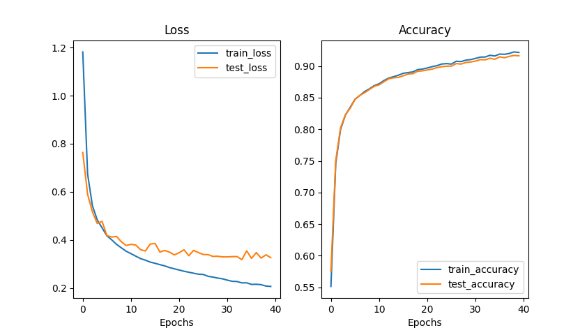
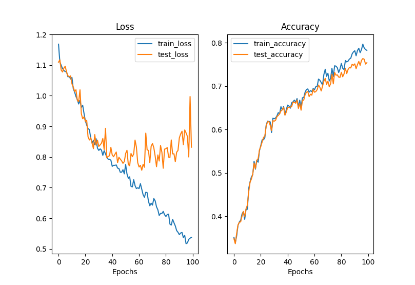
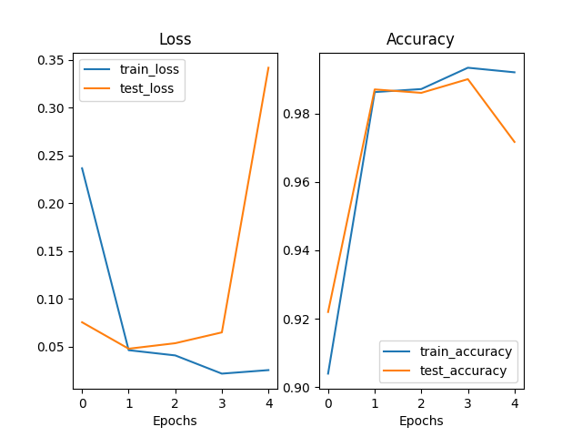

# Basic machine learning tasks with PyTorch

Course: https://www.learnpytorch.io
- [Linear regression](linear_regression)
- [Binary classification](bin_classification)
- [Multi-class classification](multi_classification)
- [Multi-class classification with CNN](multi_class_cnn)
- [Multi-class classification with CNN on another dataset](multi_class_cnn_custom_dataset)
- [Multi-class classification with ViT](multi_class_vit) - replicating the [paper](https://arxiv.org/pdf/2010.11929)
- [Fine-tuning pretrained ViT for multi-class classification](fine_tuninng_multi_class_vit)

### ViT training (from scratch) results on FashionMNIST
#### Hyperparameters:
    image size:     28x28       batch size:             256         transformer layers: 8
    color channels: 1           train dataset length:   60000       attention heads:    7
    patch size:     14          classes:                10          learning rate:      0.001

### ViT training (from scratch) results on Food101 3 classes subset
#### Hyperparameters:
    image size:     64x64       batch size:             75          transformer layers: 8
    color channels: 3           train dataset length:   2250        attention heads:    8
    patch size:     16          classes:                3           learning rate:      0.001

### ViT fine-tuning (vit_b_16 from torch.models) results on Food101 3 classes subset
#### Hyperparameters:
    image size:     224x224     batch size:             50          transformer layers: 12
    color channels: 3           train dataset length:   2250        attention heads:    12
    patch size:     16          classes:                3           learning rate:      0.001

    